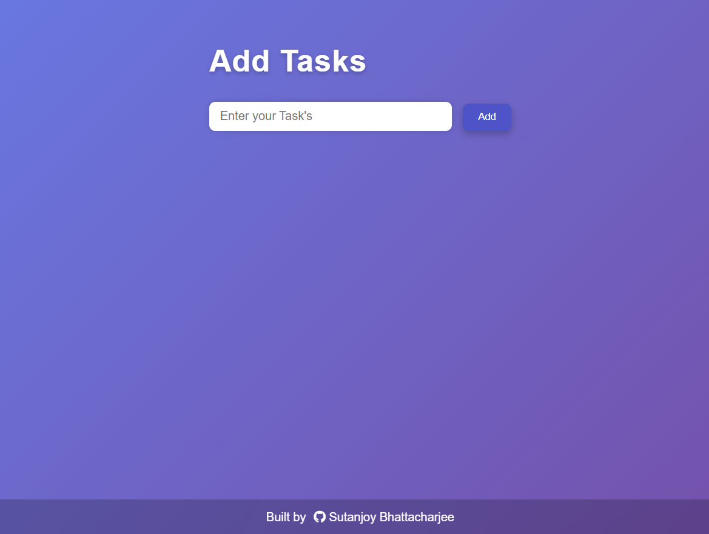
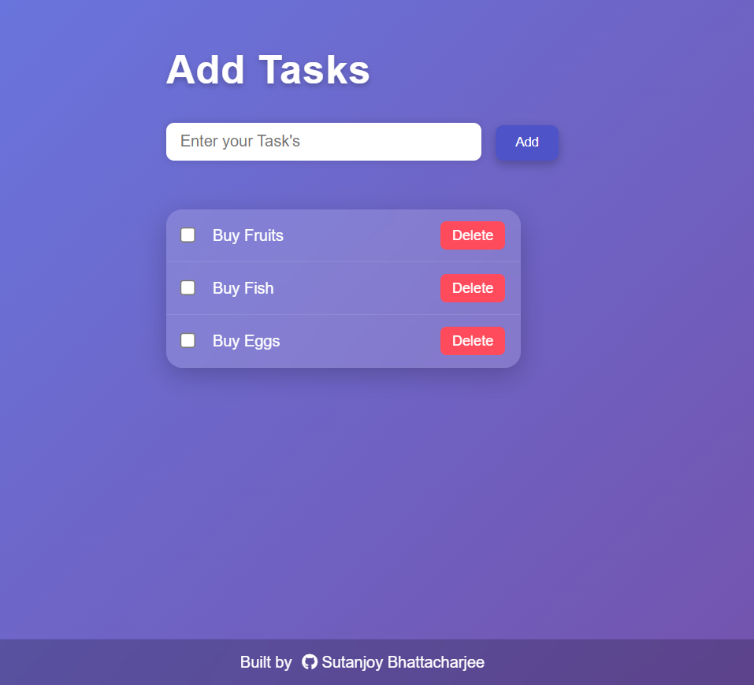
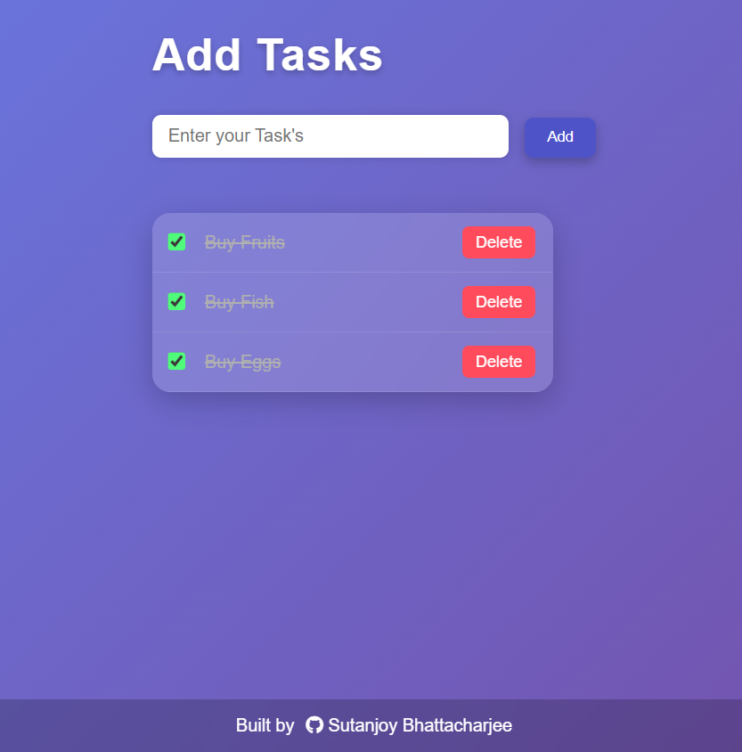

# 📝 ToDo List App

A clean and responsive **To-Do List Web Application** built using **HTML, CSS, and JavaScript**.  
Tasks are stored in the browser using **LocalStorage**, so they remain saved even after refreshing the page.

---

## 🚀 Features

- ✅ Add new tasks  
- ✅ Mark tasks as completed  
- ✅ Edit tasks (double-click to edit)  
- ✅ Delete tasks  
- ✅ Persistent storage using LocalStorage  
- ✅ Smooth animations  
- ✅ Responsive design  
- ✅ Modern glassmorphism UI  

---

## 🛠️ Built With

- HTML5  
- CSS3  
- JavaScript (ES6)    

---

## 📂 Project Structure

```
To-Do-List/
│
│── images/
    ├── HomePage.png
    ├── TaskAdded.png
    └── TaskCompleted.png
├── index.html
├── style.css
├── script.js
├── README.md
```

---

## 📸 Screenshots

<p align="center">
  <br/>
  <b>Home Page Interface</b>
</p>

<p align="center">
  <br/>
  <b>Add Task Interface</b>
</p>

<p align="center">
  <br/>
  <b>Completed Task View</b>
</p>

---

## ⚙️ How It Works

### 1️⃣ Adding a Task
- User types a task into the input field.
- Clicks the **Add** button.
- The task is added to the `todos` array.
- The list re-renders.
- Data is saved to LocalStorage.

### 2️⃣ Completing a Task
- Clicking the checkbox updates the `completed` property.
- A strike-through style is applied.
- Changes are saved automatically.

### 3️⃣ Editing a Task
- Double-click on the task text.
- A prompt appears.
- Updated text is saved.

### 4️⃣ Deleting a Task
- Click the Delete button.
- Task is removed using `splice()`.
- List re-renders.
- LocalStorage updates.

---

## 📥 Installation & Setup

### 1️⃣ Clone the Repository

Open your terminal and run:

```bash
git clone https://github.com/sutanjoyb/ToDoList.git
```

### 2️⃣ Navigate to the Project Folder

```bash
cd To-Do-List
```

### 3️⃣ Open the Project

Since this is a simple HTML, CSS, and JavaScript project, no dependencies are required.

You can open it in two ways:

#### ✅ Option A: Open Directly
- Double-click `index.html`

#### ✅ Option B: Use VS Code (Recommended)

```bash
code .
```

Then right-click `index.html` → Open with Live Server  
(or install the Live Server extension if not already installed)

---

## ▶️ How to Use

1. Enter a task in the input field.
2. Click the **Add** button.
3. Mark tasks complete using the checkbox.
4. Double-click a task to edit it.
5. Click **Delete** to remove a task.

Your tasks will remain saved even after refreshing the page.

---

## 🤝 Contributing

Contributions are welcome!

If you'd like to contribute:

### 1️⃣ Fork the Repository

Click the **Fork** button on GitHub.

### 2️⃣ Clone Your Fork

```bash
git clone https://github.com/your-username/ToDoList.git
```

### 3️⃣ Create a New Branch

```bash
git checkout -b feature-name
```

### 4️⃣ Make Your Changes

Edit the files and improve the project.

### 5️⃣ Commit Your Changes

```bash
git add .
git commit -m "Add some feature"
```

### 6️⃣ Push to GitHub

```bash
git push origin feature-name
```

### 7️⃣ Open a Pull Request

Go to GitHub and submit a Pull Request.

---

## ⭐ Support

If you like this project, consider giving it a ⭐ on GitHub!

---

👨‍💻 Author

Designed & Developed by:
**Sutanjoy Bhattacharjee**
